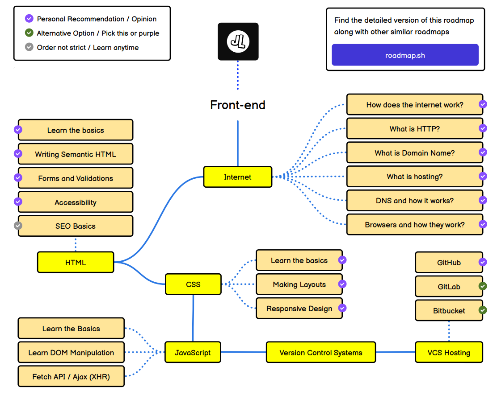

  
  
  <h1 align="center">Frontend Roadmap</h1>  
  

    
  

  

    <a href="https://roadmap.sh/frontend">
    	roadmap.sh
    </a>    
  
  
  

    
  

  <h2 align="center">Guía de estudio Frontend</h2>
  

    <h3>Principales Bloques</h3>
    <ul>
      <li><a href="https://es.wikipedia.org/wiki/HTML">HTML</a></li>
      <li><a href="https://es.wikipedia.org/wiki/CSS">CSS</a></li>
      <li><a href="https://es.wikipedia.org/wiki/JavaScript">JAVASCRIPT</a></li>
    </ul>
  

---
### HTML
- Conceptos básicos
  - [web.dev: Learn HTML](https://web.dev/learn/html)

### CSS
- Conceptos básicos
  - [web.dev: Learn CSS](https://web.dev/learn/css?hl=es)

    

## Recursos
### CSS
- [Juego interactivo de selectores](https://flukeout.github.io/)
- [Selectors Explained - Translate CSS selectors into plain English](https://kittygiraudel.github.io/selectors-explained/)
